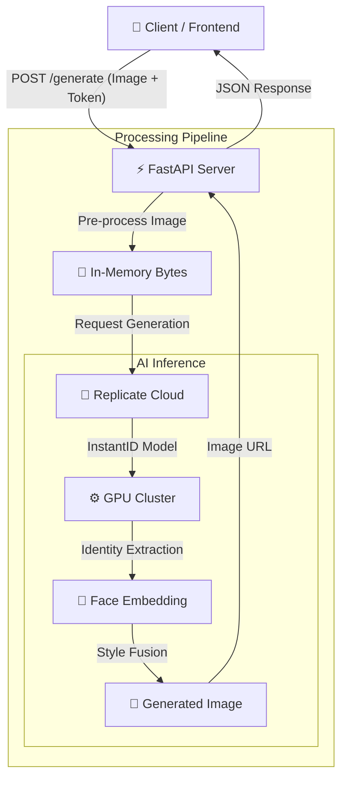

# 🪄 AI Magic Studio – Backend

A high‑performance FastAPI backend for AI‑powered photo personalization. This service acts as a secure bridge between your frontend and Replicate’s **InstantID** model, transforming ordinary photos into stylized 3D / Disney‑style illustrations while preserving facial identity.

---

## ✨ Overview

**AI Magic Studio – Backend** is a stateless microservice built with FastAPI. It:

* Accepts an input image from the client
* Proxies the request to Replicate’s `instantx/instant-id` model
* Returns a generated, stylized image URL

The goal is to provide a simple, production‑ready backend that your frontend (web or mobile) can plug into without dealing with AI model complexity.

---

## 🏗️ Architecture

The backend sits between your client and Replicate’s cloud inference.



---

## 🚀 Features

* **Identity Preservation**: Uses **InstantID** to keep the subject’s face recognizable in the generated art.
* **FastAPI Powered**: Asynchronous, high‑performance Python API server.
* **Secure Proxying**: Handles image ingestion, conversion to bytes, and communication with Replicate.
* **CORS Enabled**: Ready to connect with browser or mobile frontends out of the box.
* **Simple JSON Responses**: Consistent response schema that is easy to consume from any client.

---

## 🧠 Model Choice: InstantID

We use **InstantID** (`instantx/instant-id`) hosted on **Replicate**.

Why this model?

* **Zero‑shot identity preservation**: No need to train a LoRA or fine‑tune a separate model per user.
* **High‑quality stylization**: Works well for 3D / Disney‑style characters that still look like the original person.
* **Fast iteration**: Perfect for an MVP and scalable enough for production workloads.

Unlike:

* **LoRA‑based Stable Diffusion**: Requires per‑user training, which is slow and expensive.
* **ControlNet**: Great for pose and structure, but not optimal for preserving detailed facial identity.

---

## 🛠️ Tech Stack

* **Language / Framework**: Python, FastAPI
* **AI Provider**: Replicate (`instantx/instant-id`)
* **Server**: Uvicorn
* **File Uploads**: `python-multipart`
* **Other Utilities**: Standard FastAPI / Pydantic tooling

---

## ⚙️ Setup & Installation

### 1. Clone the repository

```bash
git clone https://github.com/yourusername/ai-magic-studio.git
cd ai-magic-studio/backend
```

### 2. Create and activate a virtual environment

```bash
python -m venv venv

# Windows
venv\Scripts\activate

# macOS / Linux
source venv/bin/activate
```

### 3. Install dependencies

```bash
pip install -r requirements.txt
```

### 4. Configure environment variables

Create a `.env` file in the `backend` folder (or use your preferred secrets manager):

```env
REPLICATE_API_TOKEN=your_replicate_api_token
ALLOWED_ORIGINS=http://localhost:3000,http://127.0.0.1:3000
```

* `REPLICATE_API_TOKEN` is required to call the InstantID model on Replicate.
* `ALLOWED_ORIGINS` is a comma‑separated list of frontend origins for CORS.

> Note: If the code uses `X-Replicate-Token` from headers instead of `.env`, keep both options available or update the implementation accordingly.

### 5. Run the development server

```bash
uvicorn main:app --reload
```

By default, the API will be available at:

```text
http://127.0.0.1:8000
```

---

## 🔌 API Endpoints

### `GET /`

Simple root endpoint (optional, depending on your implementation). Can return a welcome message or basic metadata.

---

### `GET /health`

Health check endpoint used by uptime monitors or orchestrators.

**Response**

```json
{
  "status": "ok",
  "service": "AI Photo Personalisation Backend"
}
```

---

### `POST /generate`

Main AI image generation endpoint.

#### Headers

* `X-Replicate-Token`: Your Replicate API key (if not using `.env`).

#### Body (multipart/form-data)

* `file`: The image file to process (e.g. `image/jpeg`, `image/png`).

#### Example Request (cURL)

```bash
curl -X POST "http://127.0.0.1:8000/generate" \
  -H "X-Replicate-Token: your_replicate_api_token" \
  -F "file=@/path/to/your/photo.jpg"
```

#### Example Response

```json
{
  "status": "success",
  "image_url": "https://replicate.delivery/..."
}
```

* `image_url` is typically a temporary URL hosted by Replicate’s delivery system.

---

## 🔍 How It Works (Pipeline)

1. **Upload**: Client uploads an image to `POST /generate`.
2. **Validation**: FastAPI validates the file type and size.
3. **In‑Memory Conversion**: The file is read into memory as bytes.
4. **Replicate Call**: The backend sends the image bytes and a prompt to the InstantID model on Replicate.
5. **AI Inference**: InstantID extracts identity features from the face and fuses them with the chosen style (e.g. Disney‑like 3D illustration).
6. **URL Return**: Replicate returns a delivery URL which is sent back to the client as `image_url`.

This keeps the backend **stateless** and makes it easy to scale horizontally.

---

## 🎨 Current Prompting (v1)

In **v1**, the style is hardcoded inside the backend. For example:

> "illustration of a child, soft lighting, cute, detailed, disney style"

This means all generated outputs follow the same approximate art direction. This is perfect for a focused MVP where all users want a similar style (e.g. kids‑book / Disney‑like look).

---

## 🚧 Limitations (v1)

* **Hardcoded Styles**
  The current backend locks the style prompt. Users cannot choose between different art styles yet (e.g. Cyberpunk, Anime, Watercolor, etc.).

* **Ephemeral Storage**
  Replicate’s delivery URLs are temporary. If the user doesn’t download or save the image, it may be unavailable later.

* **Synchronous Waiting**
  The `/generate` endpoint waits for AI generation to finish before responding. Under high load or during slow generations, this could cause longer response times or occasional timeouts.

---

## 🔮 Roadmap (v2)

Planned improvements for the next version:

1. **Dynamic Prompting**

   * Extend `/generate` to accept a `style` or `prompt` parameter.
   * Example values: `"3d_render"`, `"anime"`, `"oil_painting"`, `"professional_headshot"`.

2. **Persistent Cloud Storage**

   * Upload generated images to **AWS S3**, **Firebase Storage**, or similar.
   * Return a permanent, versioned URL to the client.

3. **Queue / Job System**

   * Integrate a task queue such as **Celery**, **Redis Queue**, or **RQ**.
   * `POST /generate` returns a `job_id` immediately.
   * New endpoints like `GET /status/{job_id}` can be used by the frontend to poll progress.

4. **Rate Limiting & Auth (Optional)**

   * Add API keys or auth tokens for multi‑tenant usage.
   * Add rate limits per user or per API key.

---

## 🧩 Example Frontend Integration

Here’s a minimal example using JavaScript / TypeScript on the frontend:

```ts
async function generateMagicImage(file: File) {
  const formData = new FormData();
  formData.append("file", file);

  const res = await fetch("http://127.0.0.1:8000/generate", {
    method: "POST",
    headers: {
      "X-Replicate-Token": "your_replicate_api_token", // or omit if backend uses .env
    },
    body: formData,
  });

  if (!res.ok) {
    throw new Error("Failed to generate image");
  }

  const data = await res.json();
  return data.image_url as string;
}
```

You can then display the returned `image_url` inside an `` tag or download it.

---

## 📁 Suggested Project Structure

```text
ai-magic-studio/
├── backend/
│   ├── main.py            # FastAPI application entrypoint
│   ├── core/
│   │   ├── config.py      # Settings, env handling
│   │   └── security.py    # CORS, headers, etc. (optional)
│   ├── services/
│   │   └── replicate.py   # Logic to call Replicate InstantID
│   ├── models/            # Pydantic models (request/response)
│   ├── requirements.txt
│   └── .env.example       # Example env file
└── README.md
```

> Your actual structure may differ, but keeping API, config, and external services separated helps maintainability.

---

## ✅ Testing

Basic suggestions for tests (if you use `pytest`):

* **Health endpoint test**: Ensure `GET /health` returns status 200 and the correct JSON schema.
* **Generate endpoint test (mocked)**: Mock Replicate API calls and verify that `/generate` validates input and formats output correctly.

Example command:

```bash
pytest -q
```

---

## 🚀 Deployment Notes

* Use a production server stack such as:

  * `gunicorn` or `uvicorn` behind **Nginx** or a managed reverse proxy.
  * Containerize the app with Docker for easy deployment to services like AWS ECS, Azure Container Apps, Fly.io, etc.
* Configure environment variables (Replicate token, CORS origins, etc.) via your platform’s secret manager.
* Add monitoring / logging (e.g. Prometheus, Grafana, or a hosted solution) to track latency and errors.

---

## 🤝 Contributing

1. Fork the repository
2. Create a feature branch: `git checkout -b feature/your-feature-name`
3. Commit your changes: `git commit -m "Add your feature"`
4. Push to the branch: `git push origin feature/your-feature-name`
5. Open a pull request

---

## 📜 License

Specify your license here, for example:

> This project is licensed under the MIT License.

---

## 💬 Support

If you run into issues or have feature requests:

* Open an issue in the repository, or
* Reach out to the maintainer listed in the repo description.

Happy hacking with AI Magic Studio! ✨
